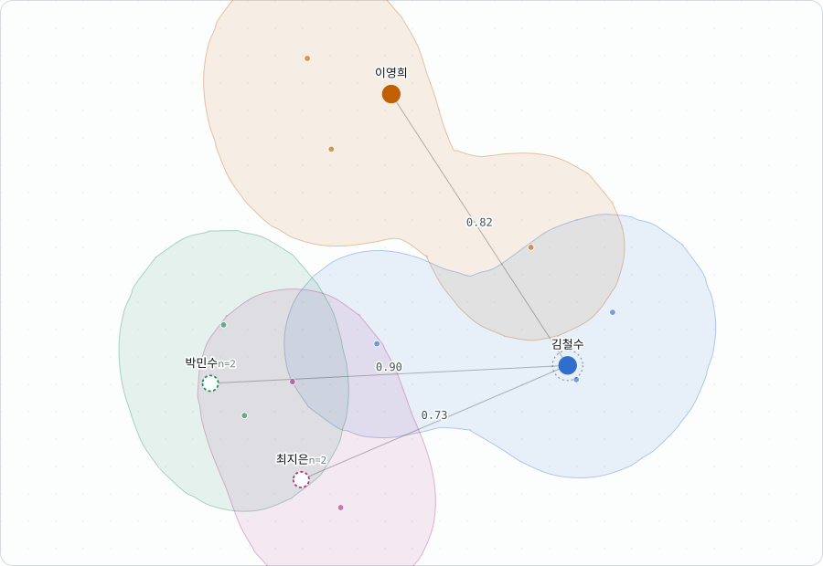

<div align="center">

# Value Constellation

**Paste a meeting transcript. See where each participant actually stands.**

[](LICENSE)
[](https://nextjs.org)
[](https://www.typescriptlang.org)
[](#status)



<sub>Real output from the transcript in <code>data/hero.ts</code>, drawn by the same code as the app (<code>npm run hero</code>).</sub>

</div>

---

Most transcript tools plot sentences and leave speaker identity in a side panel.
This one asks a different question:

> Given everything these people said, **how far apart are they?**

A participant is a position with a region around it. Every coordinate traces back
to a verbatim line. And when the map is not evidence, it says so on itself rather
than letting a confident-looking picture speak.

Korean-first, English throughout. Built for facilitators and deliberation
researchers who need to look at a room and see the shape of the disagreement.

## Quick start

```bash
git clone https://github.com/Soohwan-Lee/valueConstellation.git
cd valueConstellation
npm install
cp .env.example .env.local     # add your OPENAI_API_KEY
npm run dev                    # http://localhost:3000
```

Needs **Node 22.6+** and an OpenAI API key. The site opens on a live example with
nothing to configure, and there is a sample transcript one click away if you want
to run the pipeline without one of your own.

| Route | What it is |
|---|---|
| `/` | Overview — live demo, what each mark means, how a region is decided, examples, limits, and a working paste box |
| `/studio` | The tool — console rail, map, composer, inspector |
| `/how-it-works` | Reference — models, projections, every threshold, what happens to a pasted transcript |

## Reading the map

| Mark | Means |
|---|---|
| **Dot** | One statement. Click it for the verbatim line. |
| **Marker** | A participant, at the average of everything they said. Bigger means more statements behind it. |
| **Region** | The ground their statements cover. Two separate shapes means two separate positions, and the gap between them is ground nobody stood on. |
| **Measure line** | The gap between two people, as a share of the widest gap on that map. Select a participant to draw them. |
| **Dashed marker** | Fewer than three statements. Not yet a position. |
| **Axes** | Deliberately unlabelled. Up and across carry no meaning; only the distances do. |

Distances are always relative. Projected units mean nothing across two maps, so
nothing in the interface ever reports one.

### How a region decides its shape

The one mark whose outline comes from a decision rather than from the data
directly — so the decision is published rather than tuned.

1. For each statement, measure the distance to the nearest other statement **by
   the same person**. Pool those across everybody and take the **median**. That
   is the map's **resolution**: two statements closer together than that are not
   distinguishable positions.
2. Each statement claims the ground within one resolution of itself.
3. The outline of everything that overlaps is the region.

Four consequences, all checkable against the picture:

- A statement with nothing near it draws a circle of exactly one resolution.
- Statements within about 2.6 resolutions merge; further apart, they stay separate.
- Distances to *other people's* statements are excluded. Two people saying
  near-identical things is common, and counting those halves the figure — at which
  point every region shatters into four or five fragments. On the examples the
  difference is roughly 2×.
- The figure is **pooled into one number** rather than kept per speaker, so two
  regions are drawn at one scale and can be compared. Per speaker it would not be
  an estimate at all: three statements give two or three distances to take a median
  of, and that figure swung by 3× between speakers in the same meeting.

There is nothing to tune. No number in it was chosen because the picture looked
better with it, which is what makes the shape explainable to somebody who
disagrees with what it says about them. The usual covariance ellipse is not used:
an ellipse covers any set of points with one smooth oval, so somebody who argued
from two separate positions is drawn as having occupied the empty ground between.

The overview page shows the three steps being computed, by the same functions the
map calls.

## How much to trust a map

Two figures sit under every map, in the order a reader needs them.

**Does it tell these people apart?** Mean between-speaker distance over mean
within-speaker spread.

| Value | What the map says |
|---|---|
| ≥ 1.5 | Tells the participants apart clearly |
| 1.0 – 1.5 | Separates them, but not sharply |
| < 1.0 | **Cannot** tell them apart — usually one meeting covering several agenda items |

**How much detail survived the flattening?** Differences between statements run in
far more directions than a page has, and squashing them keeps some of it.

On real transcripts this lands between **10% and 25%**, and that is normal rather
than broken — it is what happens when 1536 directions become two. Near and far are
readable; the difference between 0.62 and 0.58 is not. Below six statements the
figure means nothing at all — a handful of points fits almost any plane exactly —
and the map says so before showing it.

## The built-in examples

Four meetings, each producing a different shape. All four run through the real
pipeline; none is a picture drawn in advance. Rebuild with `npm run fixtures`.

| Example | Statements | Separation | What it shows |
|---|---:|---:|---|
| One question, four positions | 25 | 2.24 | Four grounds, wide spread, no clustering — and two regions that come apart where somebody changed their kind of reason |
| Same yes, different reasons | 22 | 1.57 | A unanimous vote hiding three positions |
| Two people, two worlds | 21 | 2.99 | The sharpest split of the four, from a room of two |
| When the map fails | 21 | 0.45 | Three agenda items at once; every average collapses to the middle and the regions scatter |

The fourth is included **because** it fails. A reader should meet that case here,
where the map states it, rather than first on their own transcript.

Writing them was itself the finding. The first draft of the consensus example
scored 0.51 — the map could not tell the three speakers apart at all — because
each speaker had been given several distinct sub-arguments. Separation is
between-speaker distance over within-speaker spread, so a rich range of arguments
scatters somebody's own statements and buries the difference between them and
everybody else. Rewriting it so each speaker stays inside one vocabulary, drawn
from a genuinely different world — legal liability, cost recovery, and what
happens at the service counter — took it to 1.56.

## What testing on real data showed

A 57-minute five-party political debate (105 turns) is the honest test case, and
the result is a caution rather than a success.

**All five parties landed on top of each other.** Centroids fell within 0.17 of one
another while each party's own spread was 0.18–0.26. Separation: **0.38**.

In raw text embeddings, **topic dominates speaker identity**. Each party discussed
every sub-topic, so averaging across all of them returns roughly the topic centroid
for everybody.

The practical consequence: **one map wants one question.** A meeting covering
several agenda items needs a map per item. Per-speaker averaging over heterogeneous
topics is a real limitation of the method, not a bug to tune away. Making speaker
identity separable — rather than relying on raw embedding distance — is the open
research problem here.

## How it is built

```text
transcript
  → speaker attribution         rule-based, six formats, no model call
  → argument-unit segmentation  gpt-5.4-mini, 15 turns per call, 8 in flight
  → embedding                   text-embedding-3-small, 1536d
  → centroid + spread           per speaker, in embedding space
  → PCA / metric MDS            flattened to 2D, both computed
  → map
```

Segmentation splits speech into argument units — a claim never separates from its
reason — rather than into sentences. Units whose text does not occur in the source
transcript are dropped and counted, because a paraphrase would silently corrupt
every downstream coordinate.

Centroids are computed in embedding space and then projected, never averaged from
projected coordinates. The two agree only for a linear map, which is why PCA is the
default; MDS has no out-of-sample extension, so its centroids are embedded jointly
with the statements.

`/how-it-works` has the rest: both projections, every threshold with the value it
uses, and what happens to a pasted transcript.

## Design commitments

<details>
<summary>Ten rules for not being confidently wrong about people</summary>

- **A centroid never travels alone.** Every position carries its statement count
  and spread. One inferred from two statements is drawn differently from one
  inferred from forty, and below three it is marked provisional.
- **Regions are built from the statements, not fitted to them.** See above.
- **Nothing on the map is tuned.** If a shape needs fixing, change what is
  measured rather than adding a multiplier.
- **A map that shows nothing says so.** Below six statements the kept-detail
  figure is arithmetic rather than evidence, and below a separation of 1 the
  centroids are not distinguishing anybody. Both are stated on the map. A
  single-speaker transcript is refused outright.
- **Say what the number means, not what it is called.** No variance, no
  saturation, no explained-variance ratio in front of somebody trying to
  understand a meeting.
- **Assent is counted but not positioned.** "네, 맞습니다" is not a location.
  Assent and procedural turns are excluded from positions and reported
  separately: the gap between how much somebody agreed and where they actually
  sit is worth seeing.
- **Every coordinate traces back to words.** Click a point for the statement
  behind it; click a participant for everything they said, original and
  translation side by side rather than one replacing the other.
- **Colour means a person.** The eight speaker hues are the only saturated colour
  in the interface. Buttons, selection and focus are ink on paper.
- **Eight speakers is the colour limit.** Past that, hue stops separating people
  under common colour-vision deficiencies, so marker shape takes over.
- **A transcript is other people's words.** It is sent only to build the map,
  never stored, and never put in a URL.

</details>

## Project layout

```text
app/
  page.tsx                 overview: live demo, reading guide, region rule, examples, limits, composer
  studio/page.tsx          the tool: console rail, plate, composer, inspector
  how-it-works/page.tsx    reference: models, thresholds, data handling
  api/analyze/route.ts     request handling only
lib/
  analyze.ts               the pipeline, shared by the route and the fixture builder
  parse.ts                 speaker attribution, six transcript formats
  segment.ts               argument-unit schema, prompt, fabrication filter
  project.ts               PCA (power iteration) and classical MDS
  aggregate.ts             centroids, spread, saturation, separation
  blob.ts                  map resolution, and regions as its contours
  pairs.ts                 gaps between participants, in map units
  frame.ts                 the drawing frame, shared with the hero renderer
  colors.ts                speaker colour and shape assignment
  i18n.ts                  every interface string, KOR and ENG
  landing.ts / how.ts      overview and reference prose, KOR and ENG
components/                ConstellationMap, Composer, MapControls, DetailPanel,
                           Chrome, HowToRead, Preferences, Reveal
  landing/                 LiveDemo, MarkFigure, RegionSteps
scripts/                   fixture builders and the hero renderer
archive/                   frozen v1 value-vector research pipeline
```

## Scripts

| Command | Does | Costs money |
|---|---|:---:|
| `npm run dev` | Dev server on :3000 | |
| `npm run build` | Production build; also typechecks | |
| `npm test` | Parser, projection, region and distance suites | |
| `npm run typecheck` | `tsc --noEmit` | |
| `npm run fixtures` | Rebuild the four examples through the real pipeline | ● |
| `npm run hero:data` | Analyse the English transcript behind the README image | ● |
| `npm run hero` | Redraw `docs/hero.svg` from that analysis | |

Tests never call a model or hit the network. Every case in them is a format or
failure mode observed in real data rather than an invented example.

## Deploying

Works on Vercel with no configuration beyond one environment variable.

| Key | Value | Environments |
|---|---|---|
| `OPENAI_API_KEY` | `sk-…` | Production, Preview, Development |

Read server-side only. **Never prefix it with `NEXT_PUBLIC_`** — that ships the key
to the browser. Without it the site still runs and every example still renders; the
analyse endpoint returns 503 and says so in the reader's language.

The analyse route declares `maxDuration = 60`, and transcripts are capped at
120,000 characters so a paste cannot outlive the function.

## Status

Early research prototype. The pipeline runs end to end on real transcripts.

**Working** — Korean and English parsing across six transcript formats including
transcription-tool exports and Korean official minutes; argument segmentation with
a fabrication filter; participant centroids with regions; PCA and MDS with an
animated transition between them; zoom and pan; per-participant filtering; measured
gaps; per-statement traceback to source text; a composer that previews what the
parser found before spending the request; an overview that teaches the map; a
reference page; light and dark themes; KOR/ENG throughout, both persisted.

**Not built yet** — transcript ↔ map linking, participant position correction,
value-dimension axes.

## Previous generation

`archive/2026-value-vector-pipeline/` holds the first version: a Python pipeline
extracting 19-dimensional signed Schwartz value vectors from Korean policy
transcripts. It is frozen, but its findings shaped this one — see the archive
README, particularly on stance-direction instability under negation, and on
argument units being the right unit of analysis.

## License

[MIT](LICENSE) © SoohwanLee
